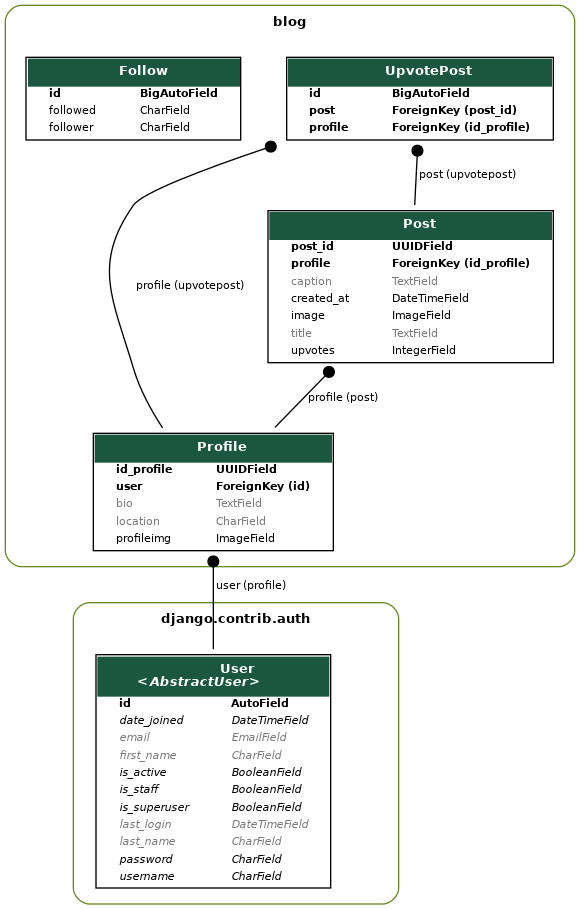

<p align="center">
  
</p>

# Connect-UIS

Connect at the University of Illinois Springfield! A social media website for UIS students, featuring:

* Email verification with Twilio SendGrid (see more in [setup twilio](#setup-twillio-and-sendgrid-integration))
* CRUD Back-end with Python's Django (create posts, profiles, leave upvotes, etc.)
* HTTPS proxy with Nginx and WSGI server with Gunicorn (accessible with port 443 and SSL certificate)
* Front-end with Bootstrap

This a project built by Damir, Zach, Brad, and Alex in Fall 2022 to graduate from our undergraduate CS program.

## Warning

This project has been archived. It is no longer supported at **connect-uis.tech**.
Unfortunately, I had to allocate my limited cloud resources elsewhere and therefore cannot keep hosting it.


# Demo

If you would like to see the demo, just head over to [docs](https://github.com/dtemir/connect-uis/tree/main/docs/demo.md).

# Contribute

Take the following steps to setup the environment and start contributing to **connect-uis**.

## Setup Environment

Create a Python virtual environment to keep your global libraries clean.

```bash
$ python3 -m venv venv
$ source ./venv/bin/activate
(venv) $ python3 -m pip install -r requirements.txt
```

## Setup Database

Setup a SQLite database for Django and create an admin user.

```bash
# create a secret Django key in your local directory
(venv) $ echo "export SECRET_KEY='$(openssl rand -hex 40)'" > .env
(venv) $ python3 manage.py migrate
(venv) $ python3 manage.py createsuperuser
Username: admin
Email address: admin@gmail.com
Password: 
Password (again):
Superuser created successfully.
(venv) $ python3 manage.py runserver # 0:8000 if running on a remote server
```

Head over to [http://127.0.0.1:8000/](http://127.0.0.1:8000/) and see that everything is running correctly.

## Model changes

If you change anything in a file titled `models.py` that defines the database schema, make sure to make migrations and apply them.

```bash
(venv) $ python3 manage.py makemigrations
(venv) $ python3 manage.py migrate
```

## Run Locally

With the help of a WSGI application server Gunicorn, you can run the site locally.

```bash
(venv) $ gunicorn -c config/gunicorn/dev.py
```

If you end up bringing the website to production with Nginx, domain name and SSL certificate ([Certbot](https://certbot.eff.org/)), make sure to use the Gunicorn production script.

```bash
(venv) $ gunicorn -c config/gunicorn/prod.py
```


## Setup Twillio and SendGrid Integration

Please reference the following documentation on [Send Email Verifications with Verify and Twilio SendGrid](https://www.twilio.com/docs/verify/email?code-sample=code-start-a-verification-with-email&code-language=Python&code-sdk-version=7.x)

You will need to create an `.env` file in `blog/` directory and specify the following
```bash
export ACCOUNT_SID='ACXXXXXXXXXXXXXXXXXXXX'
export AUTH_TOKEN='bdXXXXXXXXXXXXXXXXXXXX'
export VERIFY_SERVICES='VAXXXXXXXXXXXXXXXXXXXXXXXXXXXXXXXXX'
```


## Visualize System

If you would like to do show the interaction between models you created, run this command.

```bash
(venv) $ ./manage.py graph_models -a -I Profile,Post,UpvotePost,Follow,User -o blog-graph.png
```

